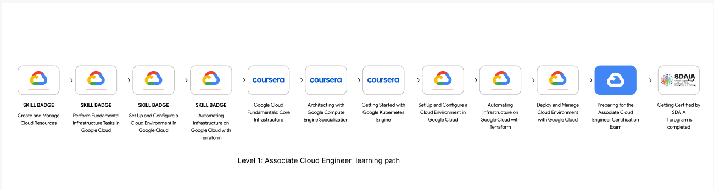

# Program Overview

## Program Description

Cloud development is the foundation for leveraging the power of AI.  This program is called “Clouder” which takes you from fundamentals to the advanced level of Google Cloud. The program uses engaging videos, labs, in-person and online lessons to teach you comprehensive topics and to prepare you for the following certificates: 

### 1. Associate cloud engineer certificate

### 2. Professional data engineer certificate.

Google is leading the learning for this program and provides you with a project-based approach for Learning, helps you retain information better, and gives you valuable experience building things in the cloud, so you’re better prepared to bring your new skills to bear in your day-to-day work and enhance your future career.

## Program  Overview

This program is a national project that aims at spreading the technical knowledge and understanding for the cloud, AI & ML in the Kingdom and helping you to gain cloud experience that is required in all fields nowadays.

*Level 1 (Associate Cloud Engineer): Get started with Google Cloud training by completing the fundamentals of Google Cloud and learn how to deploy applications, monitor operations and manage enterprise applications through Coursera courses which leads you at the end to get the Associate Cloud Engineer certification
*Level 2 (Professional Data Engineer 1/2): In this level you will experiment with end-to-end machine learning on Google Cloud, starting from building a machine learning-focused strategy and progressing into model training, optimization, and productionalization.
*Level 3 (Professional Data Engineer 2/2): In this level you will be able to design, build, operationalize, secure, and monitor data processing systems with a particular emphasis on security and compliance; scalability and efficiency; reliability and fidelity; and flexibility and portability
image
* Small edits are welcome! Please submit a Pull-Request. See also [CONTRIBUTING.md](./CONTRIBUTING.md)
* For larger edits, please submit an issue, and we will create a branch for you. Then, get the code reviewed (in the branch) before submitting.

##Level  1:  Associate Cloud Engineer
Get started by collecting Google skill badges in the 4 core areas (Create and Manage Cloud Resources - Perform Foundational Infrastructure Tasks in Google Cloud -  Build and Secure Networks in Google Cloud - Perform Foundational Data, ML, and AI Tasks in Google Cloud)

## This level includes the following courses:

### 1 [Create and Manage Cloud Resources](https://www.cloudskillsboost.google/quests/120?catalog_rank=%7B%22rank%22%3A2%2C%22num_filters%22%3A0%2C%22has_search%22%3Afalse%7D)
###  2 [Perform Foundational Infrastructure Tasks in Google Cloud](https://www.cloudskillsboost.google/quests/118?catalog_rank=%7B%22rank%22%3A1%2C%22num_filters%22%3A0%2C%22has_search%22%3Atrue%7D&search_id=17284732)
### 3  [Build and Secure Networks in Google Cloud](https://www.cloudskillsboost.google/quests/128?catalog_rank=%7B%22rank%22%3A1%2C%22num_filters%22%3A0%2C%22has_search%22%3Atrue%7D&search_id=17284749)
### 4  [Perform Foundational Data, ML, and AI Tasks in Google Cloud](https://www.cloudskillsboost.google/quests/117?catalog_rank=%7B%22rank%22%3A1%2C%22num_filters%22%3A0%2C%22has_search%22%3Atrue%7D&search_id=17284763)

## Level 2: Professional Data engineer 1/2

At this level, the 100 Certified Google Associate Cloud Engineers will have Instructor-led Classroom Training.

Overview: What is machine learning and what kinds of problems can it solve? Google thinks about machine learning slightly differently -- of being about logic, rather than just data. We talk about why such a framing is useful when thinking about building a pipeline of machine learning models. In this course, you will experiment with end-to-end machine learning on Google Cloud, starting from building a machine learning-focused strategy and progressing into model training, optimization, and production.

### 1 [How Google Does Machine Learning](https://drive.google.com/file/d/1mTCgQclOqbX4CoGtBsKN3r7s3ElENsBu/view?usp=sharing)
###  2 [Launching into Machine Learning](https://www.cloudskillsboost.google/course_templates/125)
### 3  [TensorFlow on Google Cloud](https://www.cloudskillsboost.google/quests/83?locale=en)
### 4  [Feature Engineering](https://www.cloudskillsboost.google/course_templates/11)
### 5  [Machine Learning in the Enterprise](https://www.cloudskillsboost.google/course_templates/9)

Launching into Machine Learning
TensorFlow on Google Cloud
Feature Engineering
Machine Learning in the Enterprise

## Level 3: Professional Data engineer 2/2
Overview: A Professional Data Engineer enables data-driven decision-making by collecting, transforming, and publishing data. A data engineer should be able to design, build, operationalize, secure, and monitor data processing systems with a particular emphasis on security and compliance; scalability and efficiency; reliability and fidelity; and flexibility and portability. A data engineer should also be able to leverage, deploy, and continuously train pre-existing machine learning models.

At this level, the participants will attend Professional Data Engineer to cover the following:

### 1 [the Professional Data Engineer Exam Guide](https://cloud.google.com/certification/data-engineer)
### 2 [Review the Professional Data Engineer Sample Questions](https://docs.google.com/forms/d/e/1FAIpQLSfkWEzBCP0wQ09ZuFm7G2_4qtkYbfmk_0getojdnPdCYmq37Q/viewform)
### 3  [Google Cloud Fundamentals: Big Data and Machine Learning](https://www.jellyfish.com/en-gb/training/courses/google-cloud-fundamentals-core-infrastructure)
### 4  [Modernizing](https://www.cloudskillsboost.google/course_templates/54?)
### 5  [Data Lakes and Data Warehouses with GCP](https://www.cloudskillsboost.google/course_templates/54)
### 6  [Building](https://www.cloudskillsboost.google/quests/132)
### 7  [Batch Data Pipelines on GCP](https://www.cloudskillsboost.google/quests/132)
### 8  [Knowledge consolidation & skills application](https://www.cloudskillsboost.google/catalog)
### 9  [Analytics, AI &ML](https://www.cloudskillsboost.google/course_templates/55?)
### 10 [Knowledge consolidation & skills application](https://storage.googleapis.com/cloud-training/CLS_LIVE_DataSheets/English/T-GCPPDE-A_DataSheet_RGB.pdf)

## Program Acceptance Criteria
## Level 1:
The participant should have completed a diploma or university degree in information technology and computer science and related fields.
The participant should have a GPA that meets or exceeds 3.5 to 5 or equivalent
No previous work experience is required.
The participant should have a high level of English language
The applicant must be a Saudi.

## Level 2 & 3:

The participant should collect as much as he/she can from Google badges from level 1.
The participant should get Associate Cloud Engineer certification.
The participant should be able to attend 80% of sessions and pass labs.
The participant should have basic proficiency with a scripting language, preferably Python.
The participant should pass the Interviews.

## Program Date:

4 Sep - 30 Dec 2022

## Program Advantage

Get a license for unlimited access to the entire Google Cloud course catalog and labs where learners can demonstrate their abilities in an unscripted environment.
Attend training sessions where the Expert Trainers will be available to answer any questions that the learners may have as they progress through their learning journey.
Boost your cloud career by showing the world the skills you have developed by earning Google skill badges and Google certificates.
Become a certified Google Associate Cloud Engineer.
Become a certified Google Professional Data Engineer.

